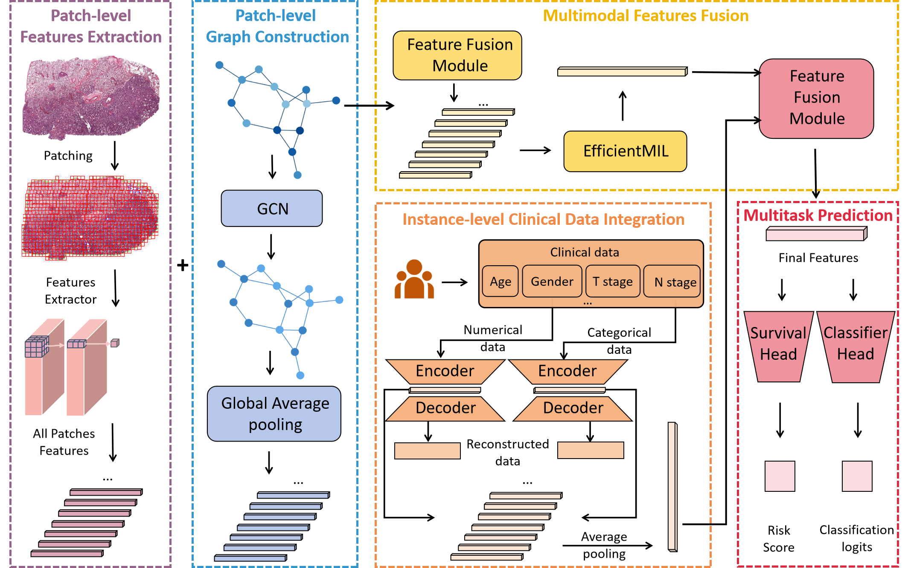

# MMSF: Multitask and Multimodal Supervised Framework for WSI Classification and Survival Analysis

MMSF (Multitask and Multimodal Supervised Framework) targets two common computational pathology tasks:
**whole-slide image (WSI) classification** and **survival risk prediction**. The core is our another work--[EfficientMIL](https://arxiv.org/abs/2509.23640), with two *optional* modalities:

- **Patch-level graph (Graph)**: models spatial/tissue topology among patches (GCN/GAT encoder) and is fused **early** at the patch level.
- **Instance-level clinical features (Clinical)**: encodes heterogeneous clinical variables with a reconstruction regularizer and is fused **late** at the bag level.



## Key Features

- **One backbone, two tasks**: the same `Network` switches heads via `task` (classification logits vs. survival risk score).
- **Linear-complexity MIL encoder**: Mamba MIL + APS (`--selection_strategy aps`, `--big_lambda` controls the number of selected patches).
- **Optional graph modality**: enable via `--use_graph`; graph files are loaded from `graph_files/*.pt` as PyG `Data` objects and fused early.
- **Optional clinical modality (survival)**: enable via `--use_clinical`; a reconstruction loss is weighted by `--clinical_loss_weight`.
- **Fusion strategy**: training scripts support `--fuse_type {none,linear,se}` (SE is the default/recommended option).


## Installation

### Requirements

- Python 3.9+
- torch==2.2.2+cu118
- torch-geometric==2.6.1
- ...

### Environment setup

```bash
conda create -n mmsf python=3.9 -y
conda activate mmsf
pip install -r requirements.txt
```

## Dataset Preparation

For a dataset root `dataset_dir` (e.g., `datasets/tcga_luad`):

```text
dataset_dir/
  ├── pt_files/                # required: one .pt per sample, typically [N, 1536]
  │    ├── <ID>.pt
  │    └── ...
  ├── graph_files/             # optional: one .pt per sample (torch_geometric.data.Data)
  │    ├── <ID>.pt
  │    └── ...
  ├── id_mapping.csv           # optional: map CSV IDs to pt/graph filenames
  ├── fold_splits.csv          # strongly recommended: K-fold splits used by training scripts
  ├── survival_data_xxx.csv    # survival labels (see below)
  └── label_xxx.csv            # classification labels (see below)
```

`pt_files/*.pt`

- Each `.pt` is a sample-level patch feature tensor.
- By default filenames use `<ID>.pt`; if `id_mapping.csv` exists, the mapped filename is preferred.

`graph_files/*.pt` (optional)

- Each `.pt` stores a PyG `Data` object with at least:
  - `x`: node features (typically aligned in length/order with patch features)
  - `edge_index`: graph edges
- File naming follows the same rule as patch features.

`id_mapping.csv` (optional)

Use this when the ID in the label CSV differs from the feature filename. Minimum columns:

- `csv_id`
- `pt_filename`

`fold_splits.csv`

You can generate it via `scripts/generate_fold_splits.py`. Expected columns:

- `ID` (must match `--id_column` used by training)
- `fold` (1..K)
- `split` (`train` or `val`)

`survival_data.csv` (Survival label CSV)

Default column names (overridable via args):

- `ID` (`--id_column`)
- `OS` (`--time_column`)
- `Status` (`--event_column`, 1=event, 0=censored)

If clinical features are enabled, column names listed in `--clinical_num_cols` / `--clinical_cat_cols`
must exist in the same CSV.

`classification_label.csv` (Classficiation label CSV)

Default column names (overridable via args):

- `ID` (`--id_column`)
- `label` (`--classification_label_column`, will be mapped to 0..C-1)

## Training

### 1) Classification

Run script `train_classification.py` (Example: Camelyon16 + graph):

```bash
python train_classification.py \
  --dataset_dir datasets/camelyon16 \
  --classification_file label_c16.csv \
  --fold_splits_csv fold_splits.csv \
  --use_graph \
  --graph_model gat \
  --graph_hidden 256 \
  --graph_out 256 \
  --patch_features_dir pt_files \
  --graph_features_dir graph_files \
  --fuse_type se \
  --device cuda:0 \
  --save_dir outputs/exp_classification/camelyon16/graph_gat
```

### 2) Survival

Run script `train_survival.py` (Example: TCGA-LUAD + graph + clinical):

```bash
python train_survival.py \
  --dataset_dir datasets/tcga_luad \
  --survival_file survival_data_luad.csv \
  --fold_splits_csv fold_splits.csv \
  --use_graph \
  --graph_model gat \
  --graph_hidden 256 \
  --graph_out 256 \
  --use_clinical \
  --clinical_hidden 512 \
  --clinical_norm zscore \
  --clinical_num_cols "Age" \
  --clinical_cat_cols "T,N,M,Gender" \
  --fuse_type se \
  --device cuda:0 \
  --save_dir outputs/exp_survival/tcga_luad/graph+clinical
```

## Inference and Evaluation (Survival)

### Export risk scores (`results.csv`)

Inference script: `scripts/infer_survival.py`:

```bash
python scripts/infer_survival.py \
  --checkpoint outputs/exp_survival/tcga_luad/graph+clinical/survival/fold_1/best.pth \
  --dataset_dir datasets/tcga_luad \
  --survival_file survival_data_luad.csv \
  --output_file outputs/exp_survival/tcga_luad/graph+clinical/survival/fold_1/results.csv \
  --use_graph --graph_hidden 256 --graph_out 256 \
  --use_clinical --clinical_hidden 512 \
  --device cuda:0
```

### Kaplan–Meier (KM) curves

```bash
python scripts/draw_km_curve.py \
  --csv outputs/exp_survival/tcga_luad/graph+clinical/survival/fold_1/results.csv \
  --title "TCGA-LUAD"
```

## Visualization (Classification patch scores)

See `scripts/visualization.py` (uses model outputs `patch_scores` / `attention_weights`):


## Reference

**MMSF: Multitask and Multimodal Supervised Framework for WSI Classification and Survival Analysis** is submiited to **Biomedical Signal Processing and Control**, and it could also be found in [Arxiv](https://arxiv.org/abs/2601.20347).

```bibtex
@misc{she2025_efficientmil,
      title={EfficientMIL: Efficient Linear-Complexity MIL Method for WSI Classification}, 
      author={Chengying She and Chengwei Chen and Dongjie Fan and Lizhuang Liu and Chengwei Shao and Yun Bian and Ben Wang and Xinran Zhang},
      year={2025},
      eprint={2509.23640},
      archivePrefix={arXiv},
      primaryClass={cs.CV},
      url={https://arxiv.org/abs/2509.23640}, 
}
@misc{she2026_mmsf,
      title={MMSF: Multitask and Multimodal Supervised Framework for WSI Classification and Survival Analysis}, 
      author={Chengying She and Chengwei Chen and Xinran Zhang and Ben Wang and Lizhuang Liu and Chengwei Shao and Yun Bian},
      year={2026},
      eprint={2601.20347},
      archivePrefix={arXiv},
      primaryClass={cs.CV},
      url={https://arxiv.org/abs/2601.20347}, 
}
```